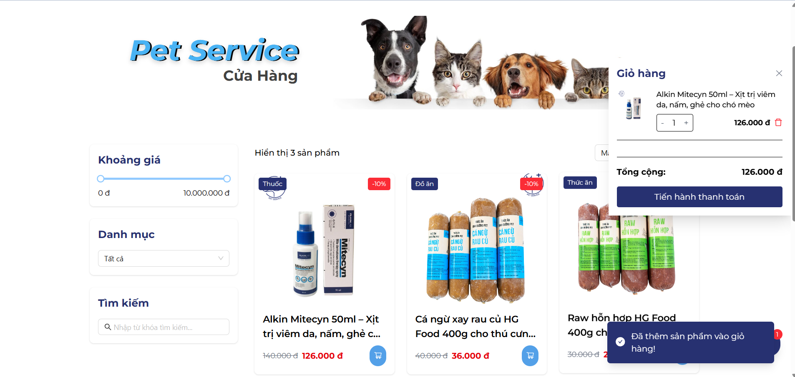

# 🐾 PetService - Hệ thống quản lý dịch vụ thú cưng

[](https://www.oracle.com/java/)
[](https://spring.io/projects/spring-boot)
[](https://reactjs.org/)
[](https://vitejs.dev/)

## 📋 Mục lục

- [Giới thiệu](#giới-thiệu)
- [Tính năng](#tính-năng)
- [Công nghệ sử dụng](#công-nghệ-sử-dụng)
- [Cài đặt](#cài-đặt)
- [Cấu trúc dự án](#cấu-trúc-dự-án)
- [Screenshots](#screenshots)
- [API Documentation](#api-documentation)
- [Đóng góp](#đóng-góp)
- [Liên hệ](#liên-hệ)

## 🎯 Giới thiệu

PetService là một hệ thống quản lý dịch vụ thú cưng toàn diện, bao gồm:
- **Frontend**: Giao diện người dùng được xây dựng bằng React + Vite
- **Backend**: API server được phát triển bằng Spring Boot
- **Database**: Hỗ trợ nhiều loại cơ sở dữ liệu

Hệ thống cho phép người dùng đặt lịch hẹn, mua sắm sản phẩm, quản lý thông tin thú cưng và nhiều tính năng khác.

## ✨ Tính năng

### 👤 Dành cho khách hàng
- 🔐 Đăng ký/Đăng nhập tài khoản
- 🐕 Quản lý thông tin thú cưng
- 📅 Đặt lịch hẹn với bác sĩ
- 🛒 Mua sắm sản phẩm online
- 📝 Xem blog và bài viết
- 💳 Thanh toán trực tuyến

### 👨‍⚕️ Dành cho bác sĩ
- 📊 Dashboard quản lý lịch hẹn
- 📋 Xem thông tin bệnh nhân
- 📝 Ghi chú và chẩn đoán

### 👩‍💼 Dành cho lễ tân
- 📞 Quản lý cuộc gọi và lịch hẹn
- 👥 Hỗ trợ khách hàng

### 🔧 Dành cho admin
- 📈 Dashboard tổng quan
- 👥 Quản lý người dùng
- 🛍️ Quản lý sản phẩm
- 📝 Quản lý nội dung

## 🛠️ Công nghệ sử dụng

### Backend
- **Java 17**
- **Spring Boot 3.x**
- **Spring Security**
- **Spring Data JPA**
- **Maven**
- **Docker**

### Frontend
- **React 18**
- **Vite**
- **JavaScript/JSX**
- **CSS3**
- **ESLint**

### Database
- **MySQL/PostgreSQL** (có thể cấu hình)

## 🚀 Cài đặt

### Yêu cầu hệ thống
- Java 17+
- Node.js 16+
- Maven 3.6+
- MySQL/PostgreSQL

### Backend Setup

1. **Clone repository**
```bash
git clone <repository-url>
cd PetService/PetService_BE/PetService
```

2. **Cấu hình database**
```properties
# application.properties
spring.datasource.url=jdbc:mysql://localhost:3306/petservice
spring.datasource.username=your_username
spring.datasource.password=your_password
```

3. **Chạy ứng dụng**
```bash
# Sử dụng Maven
./mvnw spring-boot:run

# Hoặc build JAR
./mvnw clean package
java -jar target/PetService-0.0.1-SNAPSHOT.jar
```

### Frontend Setup

1. **Vào thư mục frontend**
```bash
cd PetService/PetService_FE/PetService_FE
```

2. **Cài đặt dependencies**
```bash
npm install
```

3. **Chạy development server**
```bash
npm run dev
```

4. **Build production**
```bash
npm run build
```

### Docker Setup

```bash
# Build và chạy với Docker
docker build -t petservice-backend .
docker run -p 8080:8080 petservice-backend
```

## 📁 Cấu trúc dự án

```
PetService/
├── PetService_BE/                 # Backend (Spring Boot)
│   └── PetService/
│       ├── src/main/java/        # Source code
│       ├── src/main/resources/   # Config files
│       └── target/               # Build output
├── PetService_FE/                # Frontend (React)
│   └── PetService_FE/
│       ├── src/                  # Source code
│       ├── public/               # Static files
│       └── dist/                 # Build output
└── pic/                          # Screenshots & images
```

## 📸 Screenshots

### 🏠 Trang chủ

*Giao diện trang chủ với banner và thông tin dịch vụ*


*Phần giới thiệu về dịch vụ chăm sóc thú cưng*


*Danh sách các dịch vụ nổi bật*

### 🔐 Đăng nhập/Đăng ký

*Giao diện đăng nhập hệ thống*


*Xác nhận đăng xuất*

### 🛒 Cửa hàng

*Trang danh sách sản phẩm*


*Bộ lọc và tìm kiếm sản phẩm*


*Giỏ hàng và thanh toán*


*Chi tiết sản phẩm*


*Thông tin và đánh giá sản phẩm*

### 📅 Đặt lịch hẹn

*Giao diện đặt lịch hẹn với bác sĩ*

### 📝 Blog

*Trang blog với danh sách bài viết*


*Chi tiết bài viết blog*

### 👤 Thông tin cá nhân

*Dashboard thông tin cá nhân*


*Quản lý thông tin thú cưng*


*Lịch sử đặt hẹn*


*Lịch sử mua hàng*


*Cài đặt tài khoản*


*Bảo mật tài khoản*

### 💳 Thanh toán

*Giao diện thanh toán*


*Xác nhận thanh toán*


*Kết quả thanh toán*

### 👨‍⚕️ Dashboard bác sĩ

*Dashboard quản lý lịch hẹn*


*Chi tiết thông tin bệnh nhân*

### 👩‍💼 Dashboard lễ tân

*Giao diện quản lý cho lễ tân*

### 🔧 Dashboard admin

*Dashboard tổng quan hệ thống*


*Quản lý người dùng*


*Quản lý sản phẩm*


*Báo cáo và thống kê*

## 📚 API Documentation

### Authentication Endpoints
```
POST /api/auth/login          # Đăng nhập
POST /api/auth/register       # Đăng ký
POST /api/auth/logout         # Đăng xuất
```

### User Management
```
GET    /api/users/profile     # Lấy thông tin profile
PUT    /api/users/profile     # Cập nhật profile
GET    /api/users/pets        # Lấy danh sách thú cưng
POST   /api/users/pets        # Thêm thú cưng mới
```

### Appointment Management
```
GET    /api/appointments      # Lấy danh sách lịch hẹn
POST   /api/appointments      # Tạo lịch hẹn mới
PUT    /api/appointments/{id} # Cập nhật lịch hẹn
DELETE /api/appointments/{id} # Hủy lịch hẹn
```

### Product Management
```
GET    /api/products          # Lấy danh sách sản phẩm
GET    /api/products/{id}     # Lấy chi tiết sản phẩm
POST   /api/products          # Tạo sản phẩm mới (Admin)
PUT    /api/products/{id}     # Cập nhật sản phẩm (Admin)
```

## 🤝 Đóng góp

Chúng tôi hoan nghênh mọi đóng góp! Để đóng góp:

1. Fork repository này
2. Tạo feature branch (`git checkout -b feature/AmazingFeature`)
3. Commit changes (`git commit -m 'Add some AmazingFeature'`)
4. Push to branch (`git push origin feature/AmazingFeature`)
5. Mở Pull Request

## 📞 Liên hệ

- **Email**: contact@petservice.com
- **Website**: https://petservice.com
- **GitHub**: [PetService Repository](https://github.com/yourusername/petservice)

## 📄 License

Dự án này được phân phối dưới MIT License. Xem file `LICENSE` để biết thêm chi tiết.

---

<div align="center">
  <p>Được phát triển với ❤️ bởi PetService Team</p>
  <p>© 2024 PetService. All rights reserved.</p>
</div>
